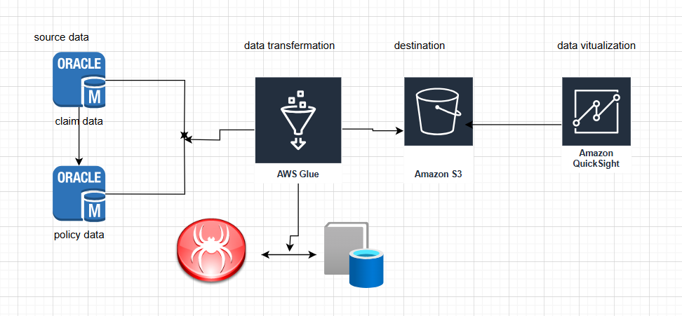

# Life-Insurance-Data-Engineering-Project
AWS Cloud Data Lake &amp; ETL Pipeline for Life Insurance Management System
# Project Overview:
 This project demonstrates how to design an end-to-end AWS-based data pipeline to ingest, transform, and store life insurance domain data from various operational systems for reporting and analytics.
 # AWS Services Used:

| Layer                  | Service                    | Purpose                                          |
|------------------------|----------------------------|--------------------------------------------------|
| 🗄️ Storage Layer       | Amazon S3                  | Raw & transformed data lake                      |
| ⚙️ ETL Engine          | AWS Glue (PySpark Script)  | Ingest & transform source tables                 |
| 🧮 Database Layer      | Amazon RDS (PostgreSQL)    | Store cleaned, structured, transformed data      |
| 🔍 Query Layer         | Amazon Athena              | Ad-hoc analysis or reporting                     |
| ⏱️ Orchestration       | AWS Glue Workflows         | Scheduling & job chaining                        |
| 📈 Logging/Monitoring  | Amazon CloudWatch Logs     | Job monitoring and failure alerts                |
# Architecture
### 🔄 ETL Pipeline Data Flow (Claimed & Not Claimed Active)

## 🔁 Data Flow

### 📥 1. Data Ingestion
Insurance data is ingested and stored in the **Bronze layer** of the Amazon S3 data lake in **Parquet** format.

### ⚙️ 2. ETL Processing
**AWS Glue** jobs extract data from the Bronze layer, perform necessary transformations (including **schema mapping** and **data masking**), and load the cleansed data into the **Silver layer**.  
✅ **Data quality checks** are enforced to maintain data integrity.

### 🗂️ 3. Data Cataloging
The **AWS Glue Data Catalog** indexes the processed data, making it discoverable and queryable for downstream applications.

### 📊 4. Model Training
**Amazon SageMaker** accesses the cleansed data from the Silver layer to train a **Linear Regression model** using a **Scikit-learn** pipeline.  
The trained model pipeline is serialized and stored in the **Golden layer** of the S3 data lake.

### 🚀 5. Real-Time Predictions
A **Streamlit** application retrieves the serialized model pipeline from S3.  
Users input customer details via the UI, and the app returns **real-time premium estimations** using the deployed model.

### 📈 6. Business Intelligence
**Tableau** connects to the data in the Golden layer to generate **interactive dashboards**, providing insights into:
- Insurance trends
- Customer demographics
- Model performance

---

## 🧰 Technologies Used

### 🗄️ Data Storage & Lake:
- **Amazon S3**

### ⚙️ Data Processing & ETL:
- **AWS Glue**
- **AWS Glue Data Catalog**
- **PySpark**

### 📊 Business Intelligence:
- **Quicksight**

### 🧱 Infrastructure as Code:
- **Terraform** (for IAM, S3, and Glue module configurations)

